# Macro Determinants of Bank Stability in the Euro Area (2000–2022)

**MSc thesis — Economics and Finance, University of Naples Federico II**  
Hatef (Leo) Tabbakhian · Supervisor: Prof. Saverio Simonelli  
Academic Year 2024–25

---

## What this paper is about

The euro area is a bank-centric system. When macroeconomic conditions deteriorate — unemployment rises, growth collapses, policy rates spike — banks absorb the damage first. The question this paper asks is simple: *how much* of the variation in bank stability across euro-area countries, and over time, can be explained by macro fundamentals alone?

This matters for policy. If you can translate a 1 pp rise in unemployment into a 1.25 pp increase in non-performing loans, you have a number you can plug into CCyB decisions, borrower-based tool calibrations, and stress-test narratives. That is what this paper delivers: a compact, evidence-based mapping from macro to stability, estimated on a consistent EA-20 panel from 2000 to 2022.

Three outcomes are studied: the **bank Z-score** (distance to distress), the **NPL ratio** (asset quality), and the **Tier-1 capital ratio** (solvency buffer). Three macro channels matter: real activity and labor markets, the monetary stance, and the credit cycle.

---

## Context: 22 years of crises

The sample covers everything — the pre-crisis boom, the global financial crisis, the sovereign-bank doom loop, the post-crisis NIRP era, and the pandemic. These are not just control variables to worry about. They are the variation that identifies the parameters.

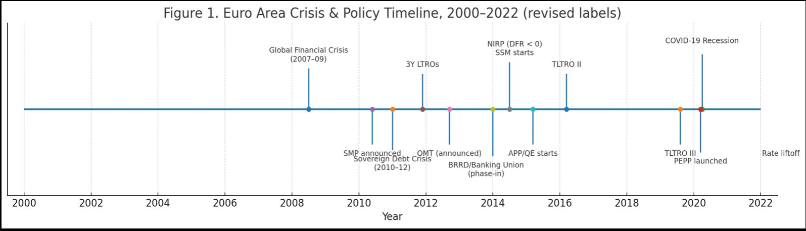

The ECB's response evolved substantially over this period: SMP, OMT, APP, TLTRO, PEPP. Each intervention changed the relationship between policy rates and bank profitability. The year fixed effects absorb the union-wide component of these shifts, leaving within-country covariation to identify the macro elasticities.

---

## Transmission mechanism

Before running any regression, it helps to be clear about how macro conditions reach bank balance sheets. There are four channels, and they operate simultaneously.

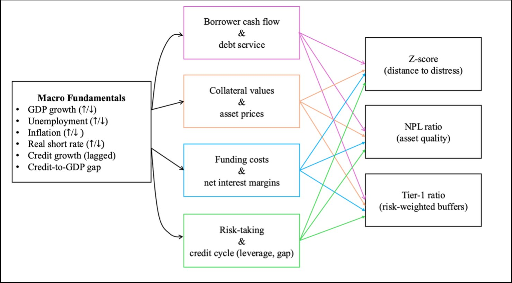

The borrower cash flow channel links unemployment and GDP growth to loan losses. The collateral channel links asset prices to credit quality. The funding cost and net interest margin channel links policy rates to profitability. The credit cycle and leverage channel links boom-phase credit expansion to subsequent fragility.

These channels produce different predictions for different outcomes. Higher unemployment hurts asset quality directly (NPL channel) and indirectly reduces capital through earnings erosion. Higher rates compress margins and Z-score but the effect on NPLs is ambiguous — rates also improve debt-service capacity for variable-rate borrowers in some circumstances. The causal chain below maps this more explicitly.

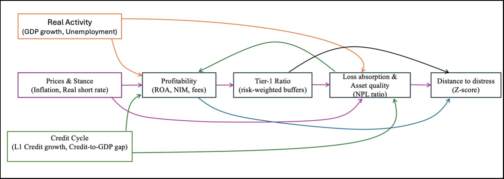

---

## Data

**Panel:** EA-20, annual, 2000–2022. Up to 460 country-years depending on outcome.

**Stability outcomes:**
- Log Z-score — GFDD/IMF FSI (distance-to-default proxy, used in logs)
- NPL ratio — supervisory 90-dpd definition
- Tier-1 capital ratio — risk-weighted capital adequacy

**Macro regressors:**
- Real GDP growth — Eurostat
- Unemployment rate — Eurostat
- HICP inflation — Eurostat
- Real short rate (policy rate minus national HICP) — ECB SDW
- Lagged credit growth (L1) — BIS-based series
- Credit-to-GDP gap — BIS-based series

**Data coverage** is dense for outcomes and core macro series. Credit-growth coverage is thinner before 2004 in a few countries. The heat map below shows availability by variable and year.

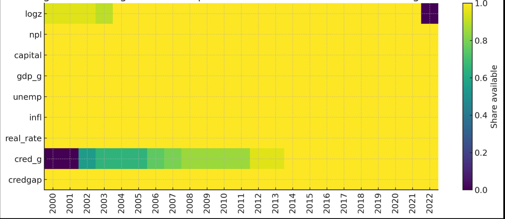

**Outcome dynamics** tell the story of the sample period. Log Z dips around 2008–2012 and recovers steadily after the sovereign debt crisis. NPLs peak in 2013–2014 — the legacy of the sovereign-bank doom loop — and decline sharply after 2015. Tier-1 ratios trend upward throughout, reflecting successive rounds of regulatory tightening under Basel III.

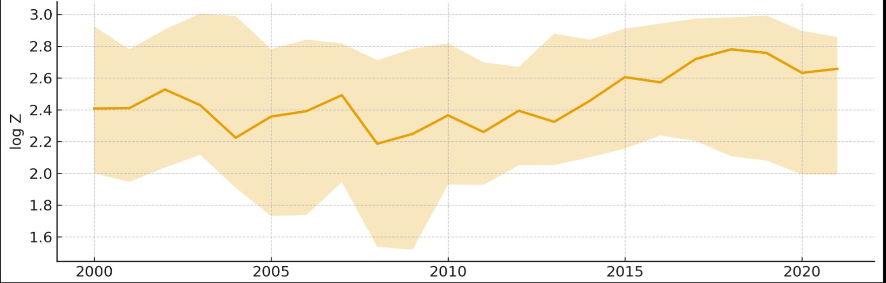
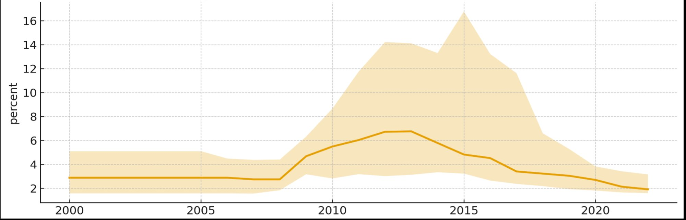
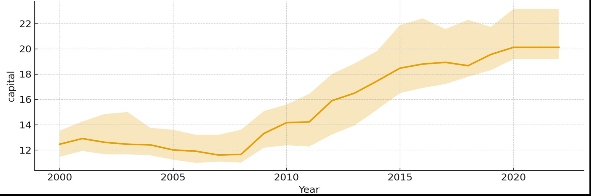

**Macro dynamics** show the two-recession structure of the sample clearly.

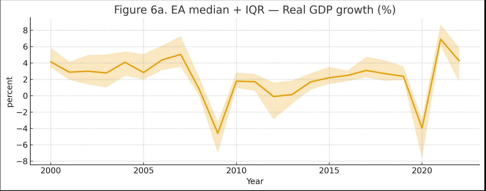
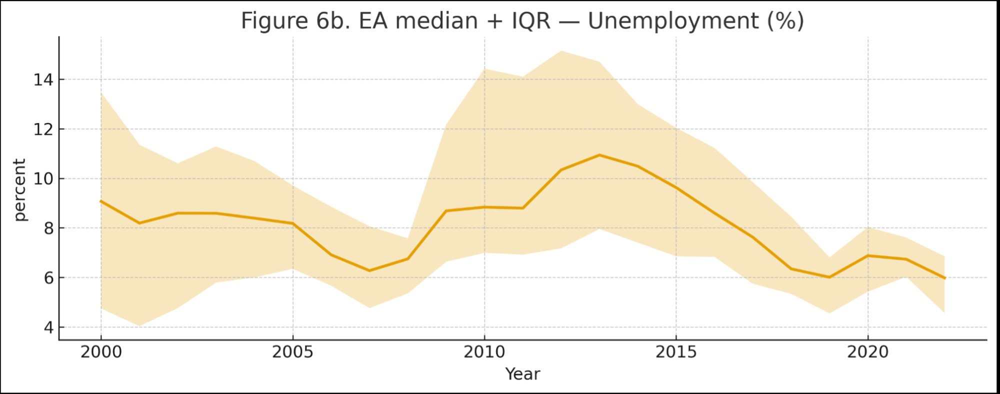
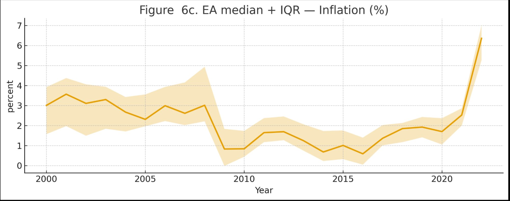
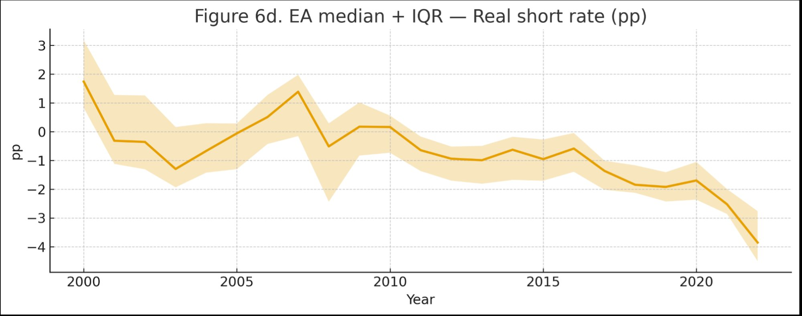

---

## Empirical strategy

Two estimators, used in tandem.

**Two-way fixed effects (FE)** absorbs time-invariant country heterogeneity with country fixed effects and euro-wide common shocks with year fixed effects. Identification comes entirely from within-country, within-year covariation. Standard errors are clustered by country. This is the transparent, interpretable baseline.

**System-GMM (Blundell-Bond)** handles the two complications FE cannot: persistence in the outcomes (Z-scores and capital ratios are highly persistent, violating strict exogeneity) and potential endogeneity between macro regressors and bank outcomes. Two-step estimator, Windmeijer-corrected standard errors, collapsed instruments, lag depth capped at 2–3, instrument count below country count. AR(1)/AR(2), Hansen J, and Difference-in-Hansen reported throughout.

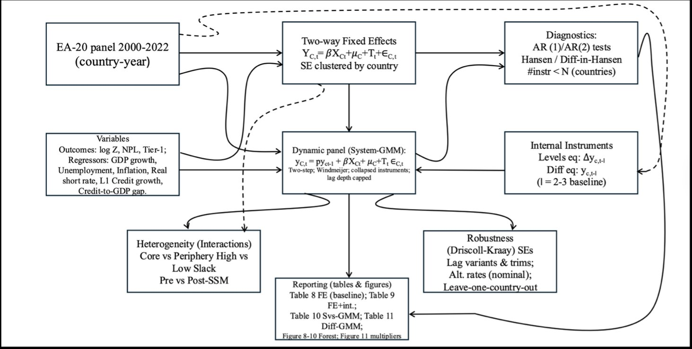

---

## Results

### Three main findings

**1. Unemployment is the dominant driver of asset quality.**

In the baseline FE, a 1 pp rise in unemployment is associated with +1.25 pp higher NPLs (p < 0.01). This estimate is stable across six robustness variants — Driscoll-Kraay errors, dropping Ireland 2015, L2 credit lags, nominal rates, regional clustering, and 1–99% trims. The sign never flips and the magnitude stays in the +1.0 to +1.3 pp range. This is the most robust finding in the paper.

The same channel, in FE, is also associated with lower Tier-1 ratios (-0.16 pp per pp of unemployment, p < 0.05), consistent with loss erosion feeding through to capital. The effect on log Z is negative but not precisely estimated in FE — the System-GMM result is cleaner.

**2. Higher real short rates compress solvency and distance to distress.**

In the System-GMM specification, a 1 pp rise in the real short rate is associated with log Z falling by 0.10 (p ≈ 0.06) and Tier-1 falling by 0.17 pp (p > 0.10 but consistent in direction). Given Tier-1 persistence (ρ = 0.929), the implied long-run effect is larger: approximately -2.4 pp per 1 pp real-rate shock, though this should be interpreted cautiously given the standard error.

This operates through the profitability channel: higher rates compress net interest margins for banks with short-duration liabilities and long-duration assets, reducing retained earnings and organic capital accumulation. The effect on NPLs is weak and not robust in sign — the rate channel is primarily a solvency and distance-to-distress mechanism, not an asset quality one.

**3. The credit cycle has early-warning content.**

The credit-to-GDP gap robustly predicts subsequent NPL increases in the dynamic specification (+0.063 pp per pp gap, p < 0.10). Lagged credit growth is adverse for Tier-1 in FE and the effect strengthens at L2, consistent with multi-year loan seasoning. For NPLs in FE, lagged credit growth is not robust on its own — the gap variable carries most of the predictive content once persistence is modeled.

These results are consistent with the procyclical leverage interpretation: boom-phase credit expansion accumulates vulnerabilities that materialize as losses and capital erosion with a lag.

### Forest plots

FE coefficient estimates and 95% confidence intervals for the full macro block.

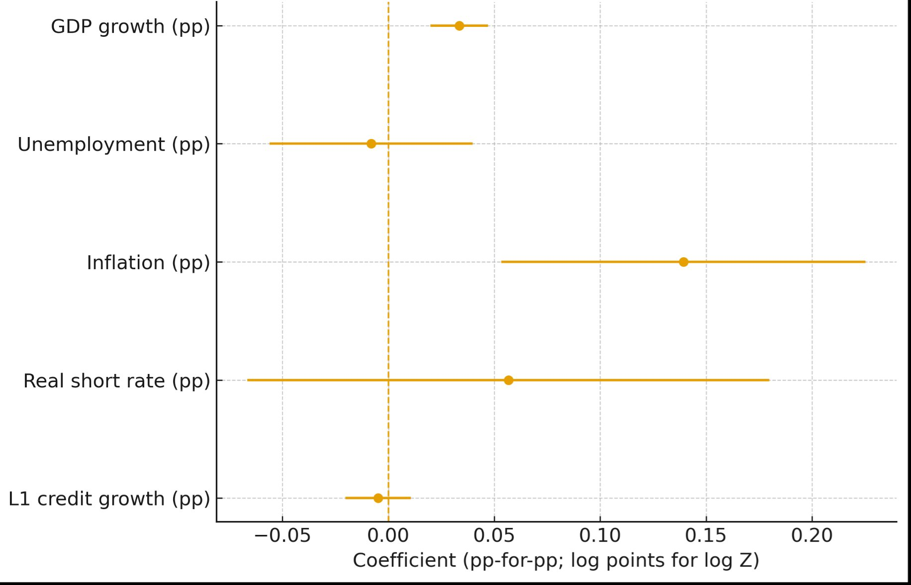
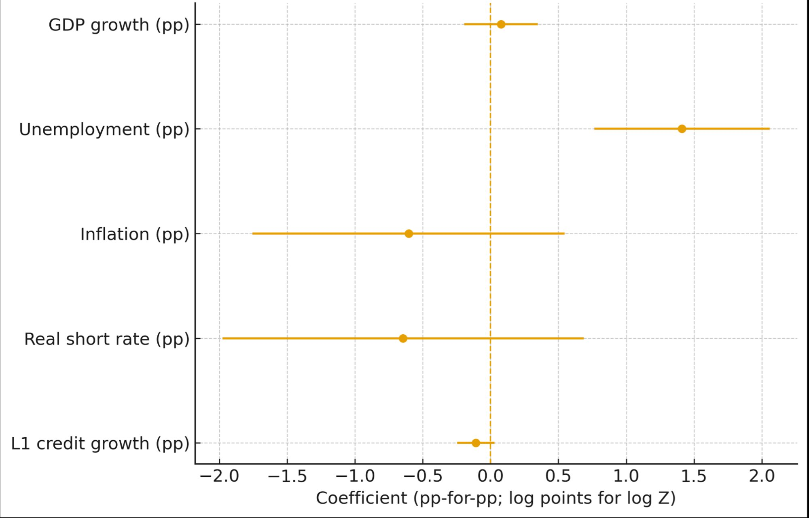
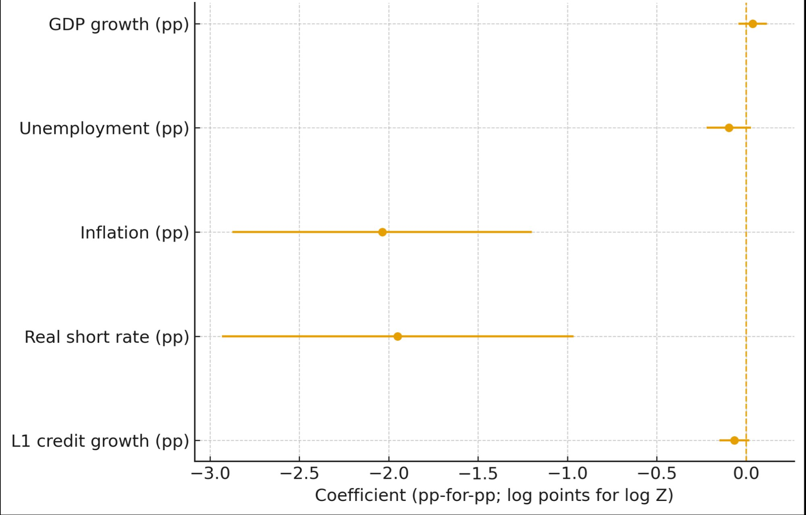

### Impulse responses

Dynamic multipliers from the System-GMM, tracing the cumulative response of each outcome to a 1 pp macro shock over 8 years.

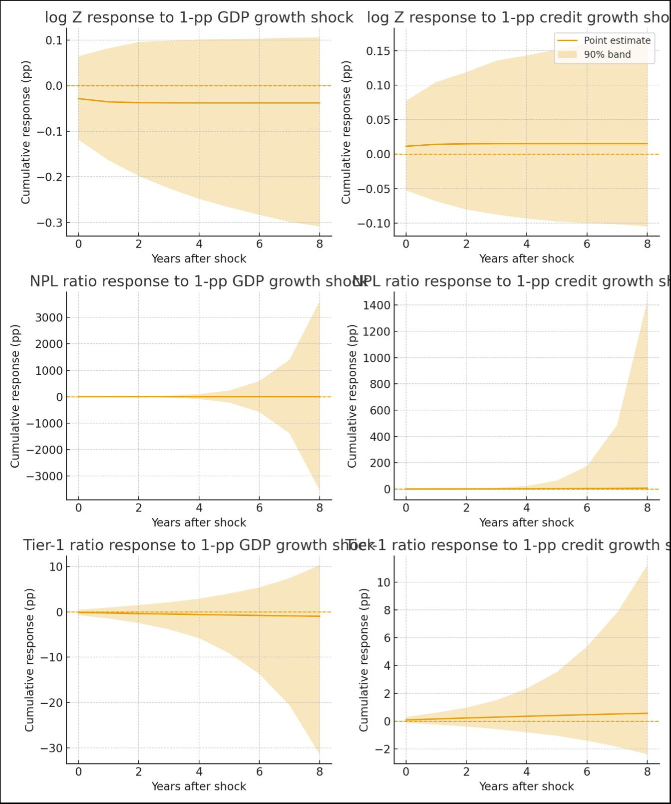

---

## Robustness

Six robustness dimensions: Driscoll-Kraay standard errors, dropping Ireland 2015, L2 credit lags, nominal policy rate substitution, regional clustering, and 1–99% winsorization. Signs are stable across all variants for the focal elasticities.

**Leave-one-country-out** confirms no single country drives the pooled results. The LOCO distribution for the unemployment-to-NPL elasticity is tight and never approaches zero.

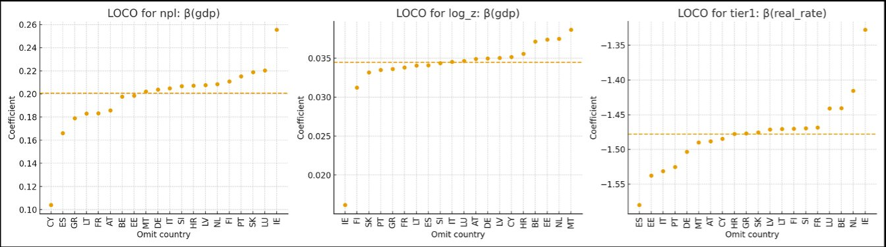

**Crisis-window exclusions** — dropping 2008-09, 2011-13, and 2020 separately and jointly — preserve directions and economic interpretation. Magnitudes adjust most for NPLs, which is expected since crisis years contain the highest-variance observations.

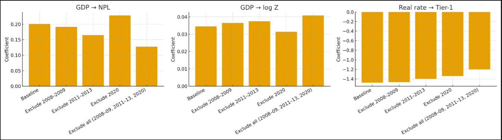

**Heterogeneity** across periphery vs core, high vs low slack, and pre vs post-SSM subsamples. The rate-to-capital channel is stronger in periphery countries and under high labor slack — consistent with the hypothesis that weakly capitalized banks in stressed economies are more sensitive to margin compression.

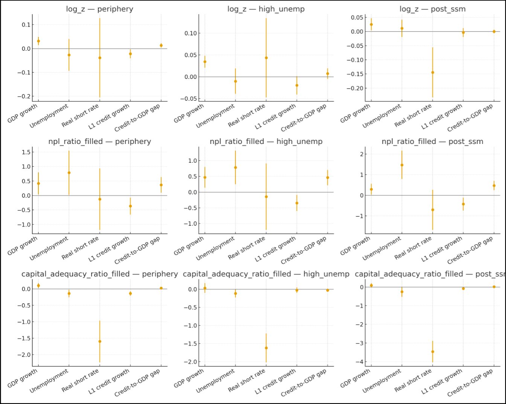

---

## Policy implications

The elasticities estimated here can be read directly into macro-financial policy discussions.

**Countercyclical capital buffer.** A 1 pp rise in the credit-to-GDP gap, sustained, predicts higher subsequent NPLs. Pre-emptive CCyB activation during credit booms is supported by the data. Release should be linked to rising unemployment, which is the most reliable leading indicator of actual credit losses.

**Rate normalization sequencing.** Higher real rates compress Tier-1, particularly in periphery countries with high wholesale funding dependence. Pairing rate normalization with CCyB space and borrower-based tools mitigates the capital compression risk.

**Supervisory dashboards.** The monitoring set suggested by this paper is four variables: unemployment, GDP growth, real short rate, and credit-to-GDP gap. Their signs are unambiguous and their elasticities are stable enough to plug into scenario analysis.

---

## Limitations and what comes next

This paper estimates country-level elasticities, not bank-level ones. Within-country portfolio composition, funding mix, and balance sheet structure remain in the error term. The real rate proxies capture the monetary stance imperfectly — term structure slope and deposit beta dynamics are not in the dataset.

Most importantly, the model is reduced-form. It quantifies *how much* macro conditions affect stability outcomes, but not *through which exact mechanism within each bank*. That requires bank-level supervisory data and a structural model.

The structural extension is the AGORA project — described below.

---

## Connection to AGORA

The results in this paper raise a natural follow-up question: *how do macro shocks propagate through the interbank network, and why does contagion amplify them?*

The panel regressions treat each country as independent conditional on fixed effects. In reality, banks are connected — through interbank lending, sovereign bond holdings, dollar funding markets, and confidence channels. A shock to one bank cascades through the network. The country-level elasticities estimated here aggregate over all of this network structure.

**AGORA** is an agent-based banking stability simulator that makes the network explicit. Each bank is an agent with a full balance sheet: loans, securities, interbank exposures, deposits, wholesale funding, capital. Shocks propagate through five channels — counterparty losses, liquidity withdrawal, fire sales, confidence/CDS spread, and dollar funding freeze.

The Italian sovereign crisis simulation produces results that are quantitatively consistent with the panel elasticities estimated here. A 15% BTP haircut plus 40% deposit run on UniCredit generates 520bn EUR in system-wide losses across 7 banks, with JPMorgan and UBS surviving unaided while all five European banks require ECB emergency liquidity. The contagion multiplier — total losses relative to the initial shock — is directly comparable to the credit-cycle leverage estimates in the System-GMM.

The plan is to calibrate AGORA's shock parameters to the actual 2011 crisis episode using the EBA transparency exercise data, then compare the simulated contagion path against the realized NPL and Tier-1 trajectories from the panel. That comparison is Paper 1.

**AGORA repository:** [github.com/Leotaby/Agora](https://github.com/Leotaby/Agora)

---

## Repository structure

```
.
├── figures/              19 thesis figures (PNG)
├── stata/                4 Stata replication scripts
├── data/                 Processed panel data (raw data not versioned)
├── docs/                 Thesis PDF and data dictionary
├── notebooks/            Jupyter notebooks for EDA
├── src/macrobank/        Python package for replication
├── scripts/              Build and figure scripts
└── tests/                Unit tests
```

## Replication

**Stata** (primary): run scripts in `stata/` in order — `Stata_Baseline.do` → `Stata_Baseline_FE_GMM.do` → `STATA_Baseline_FE_GMM_AR_HSN.do` → `STATA_Baseline_FE_GMM_AR_HSN2.do`.

**Python** (supplementary):
```bash
make setup
make data
make figures
```

Data sources: GFDD/IMF FSI (Z-score, NPL, Tier-1), Eurostat (GDP, unemployment, HICP), ECB SDW (policy rate), BIS (credit series).

---

## Citation

```bibtex
@mastersthesis{tabbakhian2025,
  author  = {Tabbakhian, Hatef},
  title   = {Macro Determinants of Bank Stability in the Euro Area (2000--2022)},
  school  = {University of Naples Federico II},
  year    = {2025},
  type    = {MSc thesis, Economics and Finance}
}
```
